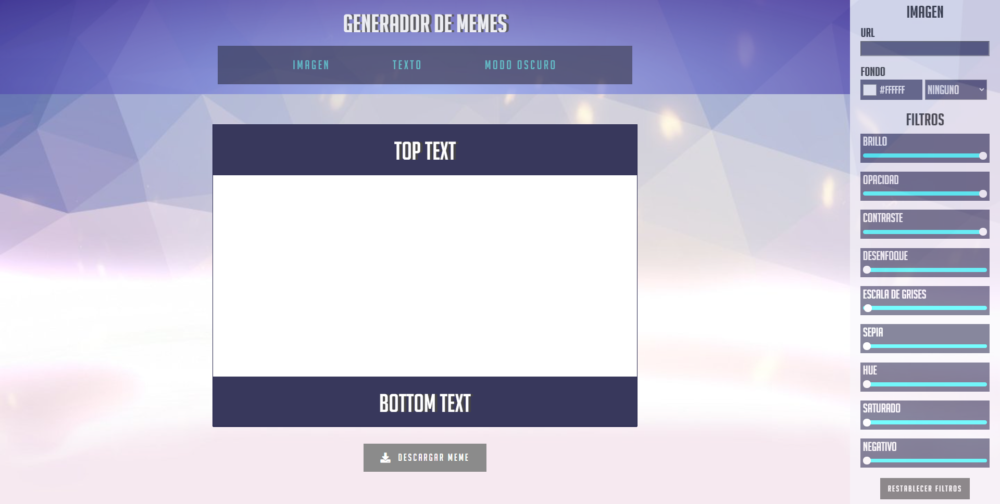
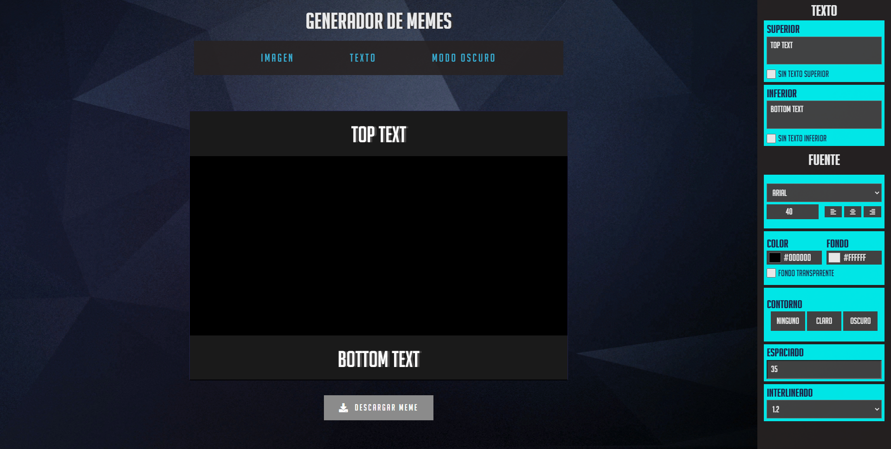

# Generador de memes

## Crea memes únicos y personalizados en minutos!.

***
<br> 

### Èste sitio web fue desarrollado para crear memes gratis de manera sencilla. Con las herramientas de imagen y texto sumaodo a tu creatividad vas a poder personalizar colores, filtros de imagen, tipografia, tamaño de letra, entre otros.

<br>

### En cuanto al diseño, fue inspirado en [OVERWATCH](https://playoverwatch.com/es-es/) un juego de tipo FPS (First-person shooter) desarrollado por [Blizzard Entertainment](https://www.blizzard.com/es-es/).

***
<br>

### Para poder ver mi trabajo hace click [aquì](https://mandisa-94.github.io/generador-de-memes/) o tambien podes acceder desde el siguiente [enlace](https://generador-de-memes.netlify.app/).

***
<br>

### Si querés tener el codigo en tu pc tenes que seguir estos pasos en tu terminal.

- Ir al [Repositorio](https://github.com/Mandisa-94/generador-de-memes)

- Darle click al boton de forkear

- Darle click al boton de code

- Copiar la url

-Abrir tu terminal y poner el comando de 
```
git clone <url>
```
- Entrar a la carpeta del proyecto y abrirlo en tu IDE (editor de codigo).

***

### Éste proyecto requiere la instalacion de una [tipografìa](https://github.com/Mandisa-94/generador-de-memes/tree/master/Tipografia/bignoodletitling) para poder disfrutar su diseño.


### Asì se ve la vista de escritorio:

### Modo claro: 


### Modo oscuro:


***
<br>

### Este sitio fue desarrollado para [ADA](https://www.linkedin.com/school/ada-itw/) a modo de concluision del modulo de JavaScript con el fin de incorporar conocimientos y darlos a conocer al mercado laboral. Agradezco a [Jonh Parra](https://www.linkedin.com/in/jonathanparrazavala/) por ser parte de mi camino en el mundo de la programación.
***

### [Gabriela Duran](https://www.linkedin.com/in/gabriela-duran94/)


